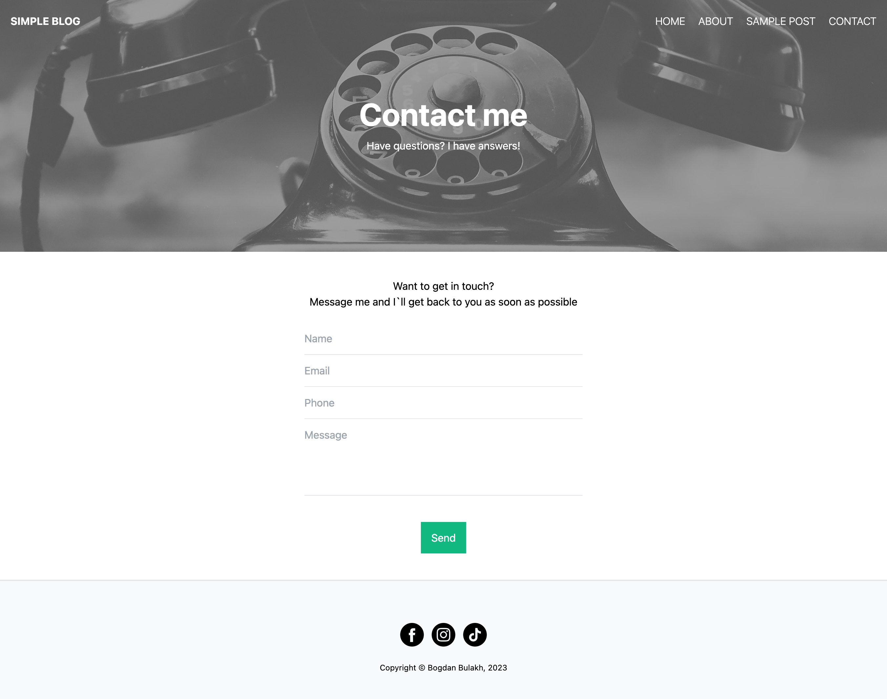

# Tailwind Simple Blog

Blog, built with the utility-first Tailwind CSS framework. 
MIT licensed - free for personal and commercial use.

## Templates Preview

<strong>Homepage</strong>
 

<strong>About Me</strong>
 

<strong>Article Preview</strong>
 

<strong>Contacts</strong>
 

## Live demo
Check the live demo here: [https://tailwind-simple-blog-demo.vercel.app/](https://tailwind-simple-blog-demo.vercel.app/)

## License
[The MIT License (MIT)](https://github.com/bbulakh/tailwind-simple-blog/blob/main/LICENSE)
